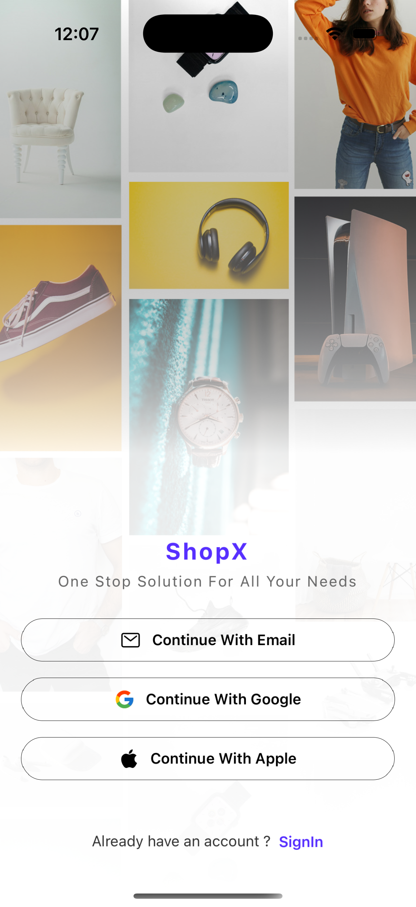
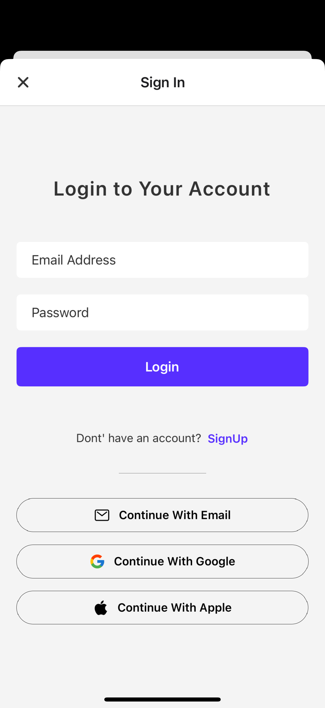
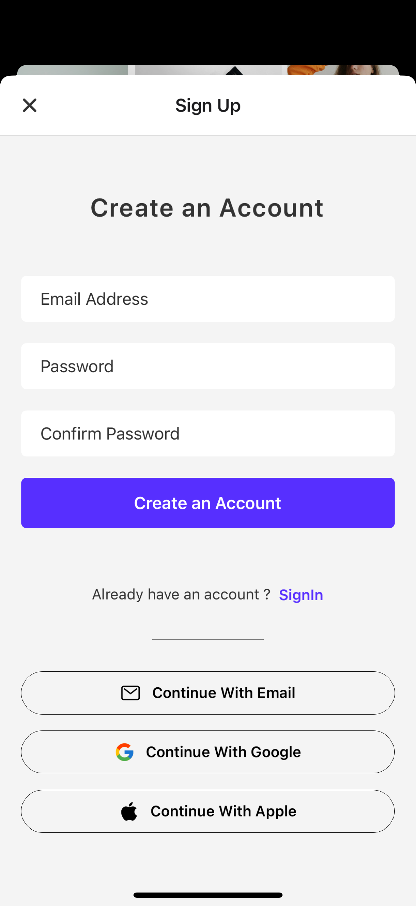
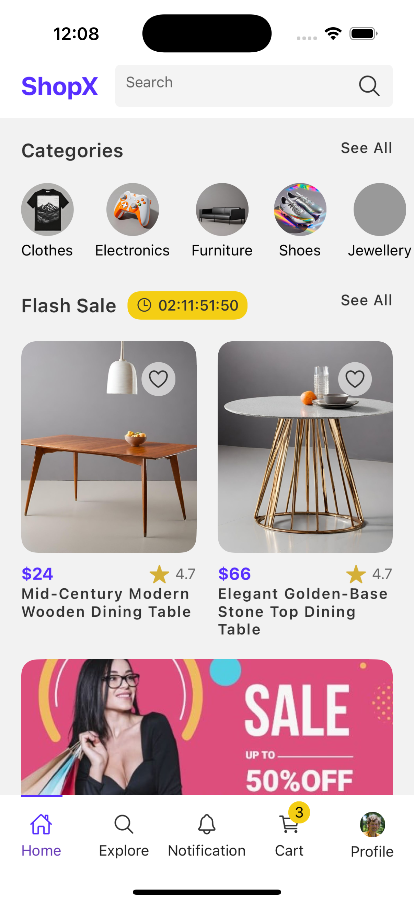
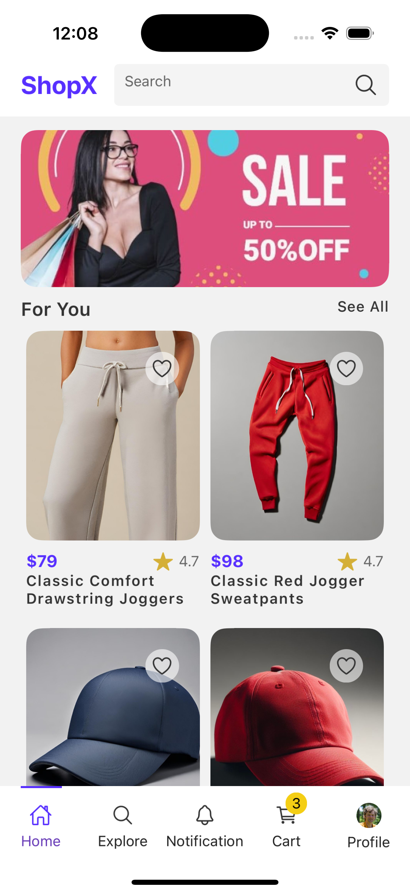

# 🛍️ Retail Shopping App

A simple **shopping app UI** built with **React Native & Expo**.
It includes **authentication screens**, a **home page with categories, flash sale, and recommended products**, and mock APIs for product data.

## 📸 Screenshots

|Login|Sign In| Sign Up| Home Page| Home Page|
|---|---|---|---|---|
||||||

## 🛠️ Tech Stack

* [Expo](https://expo.dev/) (React Native runtime)
* [Axios](https://www.npmjs.com/package/axios) – HTTP requests
* [Expo Linear Gradient](https://docs.expo.dev/versions/latest/sdk/linear-gradient/) – gradient backgrounds
* [React Native SVG](https://github.com/software-mansion/react-native-svg) – vector icons & graphics
* [React Native SVG Transformer](https://github.com/kristerkari/react-native-svg-transformer) – inline SVG support
* [JSON Server](https://github.com/typicode/json-server) – mock REST API


## 📦 Installation

1. Clone the repo:

   ```bash
   git clone <your-repo-url>
   cd retail-shopping-app
   ```

2. Install dependencies:

   ```bash
   npm install
   ```

3. Start the Expo dev server:

   ```bash
   npx expo start
   ```


## 🔌 Mock API

The app uses **JSON Server** for simulating REST APIs.

1. Install JSON Server globally:

   ```bash
   npm install -g json-server
   ```

2. Start the mock server:

   ```bash
   json-server --watch data/db.json --port 8000
   ```

3. Access mock APIs at:
   * `http://localhost:8000/saleProducts`
   * `http://localhost:8000/products`
   * `http://localhost:8000/categories`
   * `http://localhost:8000/cart`
   * `http://localhost:8000/notifications`
